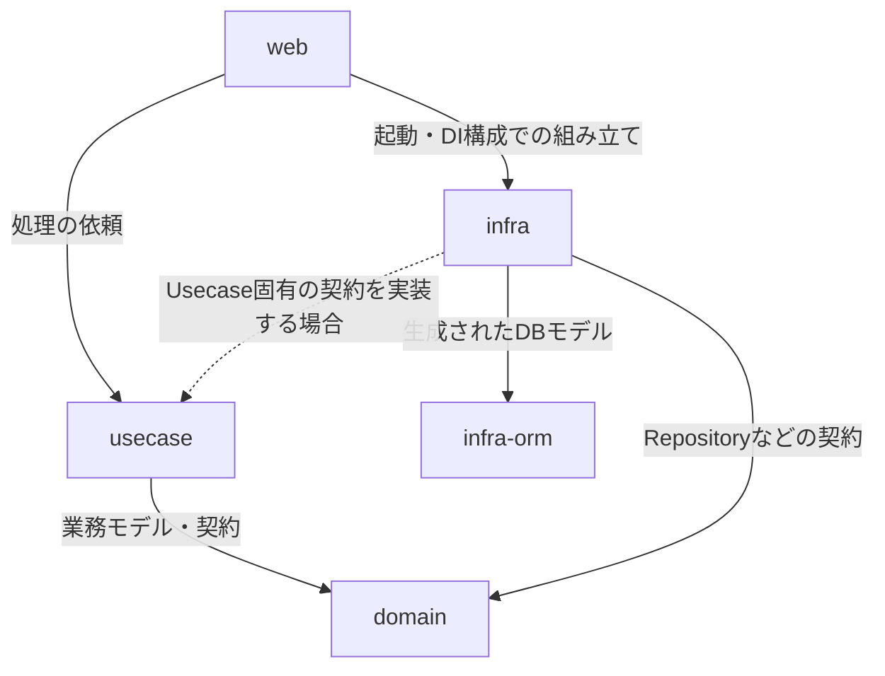
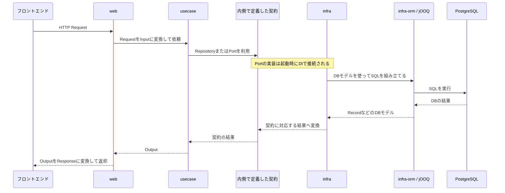

# バックエンドのアプリケーションアーキテクチャ

## 目的と適用範囲

[GitHub Issue #44](https://github.com/M0G3K0/vocal-lesson-management/issues/44)で合意した、
バックエンドの採用技術、構造、責務分担を記録する。

フロントエンドとの配置・境界は、[フロントエンドのアプリケーションアーキテクチャ](./FRONTEND-ARCHITECTURE.md)も参照する。

プロダクトを作ることに加え、DDDとClean Architectureを実践し、エンジニアとしてのスキルアップにつなげることを目的とする。

本人一人が使うサービスであっても、業務モデルと外部技術の境界を明確にする。

ここで示す構成は採用方針であり、実装済みであることを意味しない。

具体的な業務モデル、API、DBテーブルは各機能の要求・仕様に合わせて設計する。

使用バージョンとローカル環境の構築手順は、
[バックエンドのローカル開発環境](./LOCAL-BACKEND-DEVELOPMENT.md)に記載する。

## 採用技術

### Kotlin/JVM・Spring Boot・Spring Web MVC

Kotlin/JVMを実装言語とする。

Spring Bootでアプリケーションの起動・構成を行い、HTTP APIの受付と応答にはSpring Web MVCを使う。

本業で使い慣れた技術を選ぶことで、フレームワークの習得に偏らず、業務モデルや層の設計を学ぶことに時間を使える。

Springの機能は外側の構成・Web受付などで利用する。

DomainモデルにはSpringへの依存を持ち込まない。

### Gradle

Gradleの複数モジュール構成で、層ごとにコードと依存関係を分ける。

各モジュールに必要な依存先を宣言し、ビルドとテストをまとめて扱う。

パッケージだけで分ける場合よりビルド設定は増えるが、層が利用できるコードを制限できる。

Clean Architectureの境界を実践し、AIによる変更でも依存関係を維持しやすくするために採用する。

複数モジュールを一つのSpring Bootアプリケーションとして組み立てる。

[Gradle公式資料](https://docs.gradle.org/current/userguide/multi_project_builds.html)

### PostgreSQL・jOOQ・Flyway

それぞれの役割は次のとおり。

- PostgreSQL：アプリケーションの永続データを保存するリレーショナルDB。
- jOOQ：SQLによる取得・更新をコードから扱う。DB構造に対応するコードを生成し、テーブルやカラムの型情報を利用する。
- Flyway：DB構造を変更するSQLを履歴として管理し、対象DBへ適用する。

次の理由から、この組み合わせを採用する。

- SQLとスキーマ変更を明示的に扱える。
- 業務モデルと永続化モデルを分離できる。
- 本業で得た知識を活かせる。

DBの起動、マイグレーション、コード生成の準備が必要になる点も踏まえる。

[PostgreSQL公式資料](https://www.postgresql.org/about/)、
[jOOQ公式資料](https://www.jooq.org/doc/latest/manual/code-generation/)、
[Flyway公式資料](https://documentation.red-gate.com/flyway/reference/commands/migrate)

ローカル開発環境にはPostgreSQLを含める。本番DBの提供サービス、運用方法、費用は別途検討する。

## モジュールの配置

```text
backend/
├── web/
├── usecase/
├── domain/
├── infra/
└── infra-orm/
frontend/
```

バックエンドは上記の5つのGradleモジュールに分ける。

それぞれの中で、必要な業務領域や機能ごとにコードを整理する。

この文書はモジュールの境界を扱い、具体的なパッケージ名や命名規約は機能設計とコーディングガイドラインの対象とする。

## 各モジュールの説明

### 配置を決める順序

新しいクラスや処理を追加するときは、クラスの種類ではなく主たる責務で配置を決める。

1. HTTPの形式を受け取り、HTTPの形式へ返す責務なら`web`に置く。
2. 利用者の目的に沿って複数の処理を組み合わせる責務なら`usecase`に置く。
3. 業務上の意味や、業務上必ず守る条件を表現する責務なら`domain`に置く。
4. DBや外部サービスなど、特定の技術へ接続する責務なら`infra`に置く。
5. DBの構造、SQL、生成コードに直接関係する責務なら`infra-orm`に置く。

この順序で一つに決めにくい場合は、責務を分割できないかを先に検討する。

モジュール名やクラス名だけを理由に配置先を決めない。次のうち、どこが変更理由になるかで判断する。

- HTTPの形式
- アプリケーション処理
- 業務ルール
- 外部接続
- DB構造

該当する責務がない要素を、将来使うかもしれないという理由だけで先に作らない。

### 外部接続の契約を置く場所

外部接続の契約は、接続先ではなく、その契約を必要とする内側の責務が所有する。

- Domainが業務ルールを実行するために必要な契約
  - `domain`に置く。
  - 例：Aggregateを保存・取得するRepository。
- Usecaseが処理手順を実行するために必要な契約
  - `usecase`に置く。
  - 例：SHEERから予約一覧を取得する`SheerReservationSource`。
  - 例：Google Calendarへイベント登録を依頼する`CalendarGateway`。
- 契約の具体的な実装
  - `infra`に置く。
  - 例：HTTP Client、OAuth Client、jOOQを使うRepository実装。

外部サービスからデータを取得するだけの処理は、DomainのRepositoryにしない。

取得したデータがDomainの整合性や業務ルールに関係する場合だけ、Domain側の契約にする必要性を検討する。

### DBを使うかどうか

すべての機能が`infra-orm`を利用するとは限らない。

- DBへ保存・更新する必要がある機能
  - `infra-orm`にMigrationやjOOQ生成モデルを追加する。
  - `infra`にRepository実装を追加する。
- 外部サービスから取得して表示するだけの機能
  - DBモデルやMigrationを作らない。
  - 必要な外部接続を`usecase`の契約と`infra`の実装で表現する。
- 外部情報と自分のサービス内の状態を紐付けて管理する機能
  - 永続化する情報とDomainモデルを要求・仕様から決める。

### web

**概要**

HTTPリクエストを受け取り、Usecaseへ処理を依頼し、HTTPレスポンスを返す。

Spring Bootの起動と、各層の実装を組み立てる構成も扱う。

DomainモデルやjOOQの生成モデルを、そのままAPIから返却しない。

Response用のモデルを用意し、Usecaseの結果を変換して返す。RequestもUsecaseのInputへ変換し、HTTP固有の表現を内側の層へ持ち込まない。

Controllerには業務上の判断やSQLを置かない。

**含まれるもの**

- Controller
  - 責務：HTTP APIの入口として、Usecaseを呼び出す。
  - 含めるもの：ルーティング、認証・認可の入口、Inputへの変換、Usecaseの呼び出し、Responseへの変換。
  - 含めないもの：業務ルールの判断、DBアクセス、SQLの実行。
- Request
  - 責務：HTTPのJSONやパラメータを受け取る。
  - 含めるもの：HTTPの入力形式、形式として検証できる制約。
  - 含めないもの：UsecaseやDomainの入力モデルを、そのままAPIの型として公開すること。
- Response
  - 責務：APIとして公開する項目と形式を表現する。
  - 含めるもの：API契約として定義したResponseモデル。
  - 含めないもの：DomainやjOOQのモデルの直接返却。
- 境界の変換処理
  - 責務：HTTPの都合と内側の都合を分離する。
  - 含めるもの：RequestからInput、OutputからResponseへの変換。
- HTTPの入力検証とエラー応答の変換
  - HTTPの形式として検証できる条件を扱う。
  - 業務条件の判定はDomainまたはUsecaseへ委譲する。
- Spring Bootの起動クラスとDI構成
  - 具体的な実装を組み立てる。
  - 業務処理の実装場所にはしない。

HTTP APIとして外部へ公開する必要があるものだけをここへ置く。内部処理、DBアクセス、業務上の計算は、HTTPから呼ばれる場合でも`web`へ移さない。

### usecase

**概要**

利用者の目的に沿って、Domainの業務処理とRepositoryなどの契約を使い、アプリケーションの処理手順を調整する。

HTTPのRequest・Responseを直接扱わず、Usecase用のInput・Outputで入出力を表現する。

DBアクセスや外部APIの実装を直接持たず、内側に定義した契約を通して利用する。

業務モデル自体が守るべきルールはDomainへ置く。

**含まれるもの**

- Input
  - 責務：Usecaseに渡す入力を表現する。
  - 含めるもの：HTTP、バッチ、別の入口から渡される処理入力。
  - 含めないもの：特定の入口だけが持つ形式。
- Usecase
  - 責務：利用者の一つの目的に対応するアプリケーション処理を調整する。
  - 含めるもの：処理の開始点と終了条件、必要なDomainや外部接続の契約の利用。
  - 含めないもの：業務モデルが守るべきルール、HTTP固有の処理、DBや外部APIの具体的な実装。
- Output
  - 責務：Usecaseの結果を表現する。
  - 含めるもの：WebのResponseや別の入口の出力へ変換される前の結果。
- Application Service
  - 責務：複数のDomainオブジェクト、Repository、外部接続などを組み合わせて処理手順を調整する。
  - Usecaseの実装をApplication Serviceと呼ぶ場合は、同じ責務として扱う。
  - UsecaseとApplication Serviceを、同じ処理のために機械的に分けない。
- 外部接続の契約（Port）
  - 責務：Usecaseの処理に必要な外部サービスへの操作を抽象化する。
  - 含めるもの：予約取得、Calendar登録、通知などの契約。
  - 含めないもの：HTTP Client、OAuth Client、外部サービス固有のDTOなどの具体的な実装。

「何をしたいか」がアプリケーションの処理単位として表現される場合にUsecaseを作る。基本は一つのUsecaseにInput・処理・Outputを対応させる。

DomainのEntityを一つ呼ぶだけの薄い委譲や、HTTPの形式をそのまま扱うだけのクラスは、Usecaseとして独立させる必要性を確認する。

複数のUsecaseから共通の処理手順が必要になった場合だけ、別のApplication Serviceとして切り出す必要性を検討する。

### domain

**概要**

業務上の概念とルールを表現する。DDDのモデルと、業務として必要な永続化などの契約を置く。

Spring、HTTP、jOOQなどの外部技術へ依存しない。

DBテーブルやAPIの形に合わせてDomainモデルを決めず、業務の意味と守るべき条件から設計する。

Repositoryなどの契約の実装はInfraへ置く。

**含まれるもの**

- Entity
  - 責務：識別子で同一性を扱い、状態の変化と業務上の振る舞いを持つ。
  - 採用条件：同一性や状態遷移を、業務として扱う必要がある。
  - 採用しない例：識別子を持つデータを、単に運ぶだけの場合。
- Aggregate
  - 責務：一つの整合性境界として、業務モデルを更新する。
  - 含めるもの：Aggregate Rootと、Rootから整合性を管理するEntity・Value Object。
  - 採用条件：複数のモデルを、同じ整合性境界で扱う必要がある。
  - 採用しない例：DBテーブルや画面が一つあるという理由だけで作る場合。
- Value Object
  - 責務：識別子による同一性を持たない値と、その業務上の意味・制約を表現する。
  - 採用条件：単なるプリミティブでは、業務上の条件を安全に表現しにくい。
  - 例：日時、金額、住所、レッスン時間。
- Repositoryのインターフェース
  - 責務：DomainのAggregateやEntityを保存・取得する契約を定義する。
  - 採用条件：永続化の仕組みをDomainから隠す必要がある。
  - 含めないもの：SQL、jOOQの型、外部サービス固有の形式。
  - 外部サービスからデータを取得するだけの契約は、UsecaseのPortとして扱う。
- Domain Service
  - 責務：特定のEntityやValue Object一つに自然に属さない業務ルールを表現する。
  - 採用条件：複数の業務概念にまたがるルールで、既存のモデルに置くと責務が不自然になる。
  - 採用しない例：Repositoryや外部APIを呼ぶだけのサービス、単なる処理の置き場。
- Query Model
  - 責務：業務上必要な参照結果を、更新用のAggregateとは別の形で表現する。
  - `domain`に置く条件：複数のUsecaseで再利用される、業務上の意味を持つ参照モデルである。
  - `usecase`に置く条件：一つのUsecaseでだけ使う参照結果である。
  - `web`に置く条件：APIのResponse形式へ整形した結果である。
  - 例：予約一覧の表示項目を複数のUsecaseで共通利用するなら、業務上の参照モデルとして`domain`への配置を検討する。
  - 例：予約一覧取得Usecaseだけが使う結果なら、`usecase`のOutputとして表現する。
  - 例：日時の文字列化や項目名の変更だけなら、`web`のResponse変換として扱う。
- Domain共通処理
  - 責務：複数のDomain要素から利用する、外部技術に依存しない業務上の補助処理を提供する。
  - 採用条件：特定のEntityやUsecaseに属さず、Domainの意味を表現するために共有する必要がある。
  - 採用しない例：特定のUsecaseだけの処理、HTTP・DB・外部APIへの接続。

これらは設計に用いる要素であり、各機能ですべてを必ず作るという意味ではない。AggregateはDBテーブル単位で機械的に分けず、業務上どこまで整合性を守る必要があるかから決める。

### infra

**概要**

DomainやUsecaseが必要とする外部接続の契約を、DBや外部サービスの具体的な技術で実装する。

jOOQの生成モデルとDomainモデルを変換し、DB固有の型を内側へ漏らさない。Infraでアプリケーション全体の業務手順を調整せず、Usecaseから依頼された接続処理を担う。

**含まれるもの**

- Repositoryの実装
  - 責務：`domain`で定義したRepositoryの契約を、DBなどの具体的な技術で実装する。
  - 含めるもの：jOOQを使うRepository実装、DBモデルとDomainモデルの変換。
  - テスト：RepositoryのSQLを実際のPostgreSQLで実行し、取得・更新結果を確認する結合テスト。
- 外部接続の契約の実装
  - 責務：`usecase`または`domain`で定義された契約に対して、外部サービスへの接続方法を提供する。
  - 含めるもの：SHEERやGoogle CalendarのClient、Gatewayの実装。
- 外部API Client・Adapter
  - 責務：外部サービスの認証、リクエスト、レスポンスの読み書きを担当する。
  - 含めないもの：外部サービス固有のモデルを、内側の層へそのまま返すこと。
- モデルの変換処理
  - 責務：DBモデル・外部サービスのモデルを、内側のモデルへ変換する。
  - 配置：変換理由が外部技術にあるため、対応するClientやRepositoryの近くへ置く。
- 外部接続に必要な設定
  - 含めるもの：URL、接続情報、Client設定。
  - 含めないもの：秘密情報をソースコードへ埋め込むこと。

外部サービスへ接続する処理や、DBへ保存する処理が必要になった場合に採用する。

外部接続の都合で業務ルールをここへ移したり、`infra`から`web`を呼び返したりしない。

jOOQの生成コードを直接扱う処理は、`infra-orm`との境界を意識してここへ閉じ込める。

SHEER、Google Calendar、経路検索などの具体的な接続方式やクラス構成は、ここでは確定しない。

### infra-orm

**概要**

DB構造に対応するコードと、スキーマ管理・コード生成の基盤を扱う。InfraがSQLを組み立てる際に使うDBモデルを提供する。

jOOQで生成したTables・RecordsなどをDomainモデルとして扱わない。業務ルールはここへ置かず、生成コードの変更はDB定義とコード生成を通して行う。

**含まれるもの**

- jOOQで生成するTables・RecordsなどのDBモデル
  - DBスキーマを表現するコードであり、業務上のEntityやAggregateではない。
- jOOQのコード生成設定
  - DBスキーマから生成コードを作るための設定を置く。
- FlywayのマイグレーションSQL
  - DBの構造を変更する履歴を、適用順序が分かる形で管理する。
- DB構造を管理するためのリソース
  - 生成コードの入力となるスキーマや、コード生成に必要な設定を含める。
- DB構造とコード生成の確認
  - Flywayのマイグレーションを適用できることを確認する。
  - DBスキーマからjOOQのコードを生成できることを確認する。

DBの構造やSQLの生成方法が変更理由になるものだけをここへ置く。

生成された型に業務ルールを追加したり、Domainモデルの代わりに使ったりしない。

`infra-orm`の内容を変更した場合は、対応する`infra`の変換・Repository実装への影響を確認する。

## コード上の依存関係

矢印は、依存元から依存先を示す。処理の呼び出し順とは区別する。



DomainがInfraの実装を参照する依存関係は作らない。

Infraが内側のインターフェースを実装し、起動時にその実装を組み立てる。

WebからInfraへの依存は起動・構成のためであり、ControllerがRepository実装やSQLを直接利用するためのものではない。

Usecase固有の外部接続契約が必要になった場合は、Infraがその契約を参照して実装する。具体的な契約は機能の設計で決める。

## 処理の呼び出し順とモデルの変換

DBを利用する処理の説明用の例。契約と実装の接続は、実行時にDIで行う。

DomainやUsecaseからInfraの具象クラスを直接呼び出すことはしない。

すべての処理が必ず同じ順序で全層を通るわけでもない。



`PORT`は、DomainまたはUsecaseが定義した契約を表す。

図の中で契約からInfraへ直接処理を呼び出しているわけではない。

実際の呼び出し先をDIでInfraの実装へ接続する関係を示している。

Domainの業務モデルやDomain Serviceは、必要な場合にUsecaseから利用される。

すべてのRepository呼び出しをDomain Service経由にすることや、各モジュール名と同名のクラスを作ることを求める図ではない。

## DB構造とコード生成

FlywayのSQLでDB構造を変更し、その構造に対応するコードをjOOQで生成する。Infraは生成コードを参照してSQLを扱い、Domainモデルとの変換を担う。


この図は各技術の関係を示す。

どのコマンド・タイミングでマイグレーションとコード生成を行うかは、環境構築時に具体化する。

DBを使わない機能では、この流れのうちDB・Flyway・jOOQに関する部分は発生しない。

## 例：SHEER予約取得とCalendar登録

次のような要求を実装する場合の配置例を示す。

> SHEERの予約一覧を取得し、予約を選択してGoogle Calendarへ45分のレッスン予定を登録する。

### 予約一覧を取得する場合

- `web`
  - `GET /reservations`のController。
  - HTTPのResponseモデル。
- `usecase`
  - 予約一覧取得Usecase。
  - InputとOutput。
  - SHEERから予約一覧を取得する`SheerReservationSource`の契約。
- `domain`
  - 予約の状態やレッスン時間に業務上のルールがある場合、そのルールを表すモデル。
  - 表示するだけで自分のサービス内に状態を持たない場合、DomainのAggregateは作らない。
- `infra`
  - `SheerReservationSource`の実装。
  - SHEERのHTML・外部モデルとUsecaseまたはDomainのモデルの変換。
- `infra-orm`
  - 取得結果を保存する要求がない場合は使用しない。

### Calendarへ登録する場合

- `web`
  - `POST /calendar-events`のController、Request、Response。
- `usecase`
  - Calendar登録Usecase。
  - レッスン情報をCalendar登録用の入力へまとめる処理。
  - `CalendarGateway`の契約。
- `domain`
  - 45分が業務上必ず守る条件で、Domainモデルとして扱う必要がある場合にレッスン時間を表すValue Objectを採用する。
  - API呼び出しのためのデータ変換だけなら、Domain要素を追加しない。
- `infra`
  - `CalendarGateway`のGoogle Calendar実装。
  - Google Calendar固有のRequest・Responseと内側のモデルの変換。
- `infra-orm`
  - CalendarイベントIDや同期状態を保存する要求がある場合だけ使用する。

### FEの画面を追加する場合

- `models`
  - APIのRequest・Responseモデル。
  - APIを呼び出すRepository。
- 対象機能の`pages`
  - 予約一覧Component。
  - Calendar登録操作を扱う画面側のModel、Form、Service。
  - APIモデルから画面側のModelへの変換。
- `shared`
  - 予約画面固有の処理は置かない。
  - 認証状態やアプリケーション全体のRouting Guardが必要な場合だけ利用する。

この例は、すべての機能に同じクラスを作ることを定めるものではない。要求から必要な責務だけを採用し、不要なDomainモデル、DBテーブル、共通処理を追加しないための判断例である。

## テスト基盤

JUnit Jupiterをテストの実行基盤とする。

依存先の振る舞いを置き換える必要がある場合にMockKを使う。

具体的なJUnitのバージョンは、採用するSpring Bootとの互換性に合わせて決める。

[Spring Boot公式資料](https://docs.spring.io/spring-boot/reference/testing/)、
[MockK公式資料](https://mockk.io/)

### モジュールごとの確認対象

- `domain`
  - SpringやDBを起動せずに、Entity・Value Object・Domain Serviceの業務ルールを確認する。
  - ここでは、外部サービスや永続化の具体的な実装をテスト対象へ直接持ち込まない。
- `usecase`
  - PortやRepositoryの契約をMockKなどで置き換え、処理手順と結果の組み立てを確認する。
  - 外部サービスが実際に応答すること自体は、このテストの責務にしない。
- `web`
  - RequestからInput、OutputからResponseへの変換を確認する。
  - HTTPの入力検証とエラー応答が、APIの契約どおりになることを確認する。
- `infra`
  - 外部サービス固有の形式を、内側の契約やモデルへ変換できることを確認する。
  - 外部サービスの応答異常や認証失敗など、Adapterが扱う境界も確認対象にする。
  - RepositoryのSQLを実際のPostgreSQLで実行し、取得・更新結果を確認する。
- `infra-orm`
  - Flywayのマイグレーションを適用できることを確認する。
  - DBスキーマからjOOQのコードを生成できることを確認する。
  - RepositoryのSQLを確認する結合テストは、Repository実装を含む`infra`に置く。

テストデータのBuilder、テスト作成の基準、価値の低いテストの扱いなどの詳細は、BEのコーディングガイドラインで具体化する。

