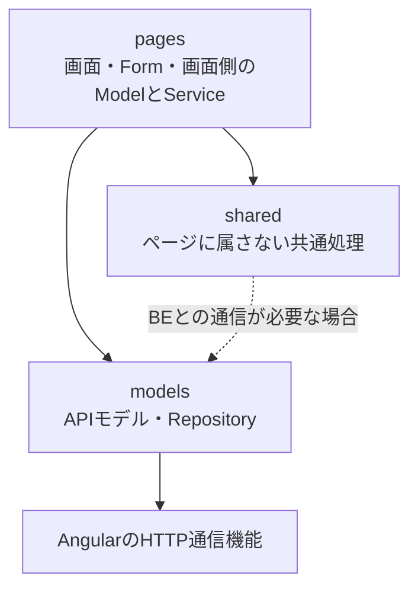
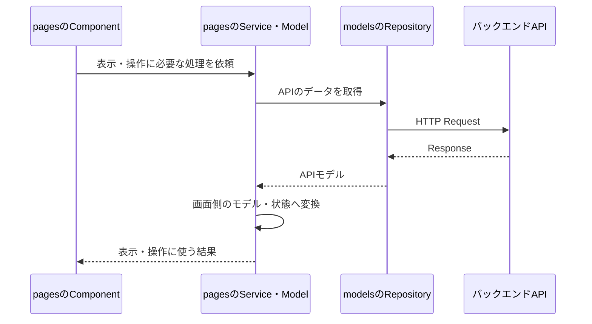

# フロントエンドのアプリケーションアーキテクチャ

## 目的と適用範囲

[GitHub Issue #44](https://github.com/M0G3K0/vocal-lesson-management/issues/44)で合意した、
フロントエンドの採用技術、構造、責務分担を記録する。

バックエンド側の構成は、[バックエンドのアプリケーションアーキテクチャ](./BACKEND-ARCHITECTURE.md)を参照する。

本人がスマートフォンとPCから利用するWebアプリケーションを、Angularで構築する。

本業で使っている整理方法を活かし、APIのモデルと画面側のモデルを分ける。

機能に関係するコードは近くへ配置する。

ここで示す構成は採用方針であり、実装済みであることを意味しない。

個別画面やAPIの仕様を確定する文書ではない。

使用バージョンとローカル環境の構築手順は、
[フロントエンドのローカル開発環境](./LOCAL-FRONTEND-DEVELOPMENT.md)に記載する。

## 採用技術

### Angular・TypeScript

Angularで画面、画面遷移、フォーム、HTTP通信などを構築する。

TypeScriptでモデルと処理を記述する。

構造のあるWebアプリケーションを作りたいという方針と、本業の知識を利用できることから採用する。

[Angular公式資料](https://angular.dev/docs)

### Vitest

Vitestを単体テストの実行基盤として使う。

AngularのComponentやServiceの生成・依存注入が必要なテストでは、Angularのテスト機能を併用する。

現在のAngular CLIは、新規プロジェクトのテスト基盤としてVitestを標準にしている。

既存のKarmaテストを移行するプロジェクトではないため、標準構成に合わせて導入・設定の負担を抑える。

Karmaが使用できないことを理由にした選択ではない。

[Angular公式資料](https://angular.dev/guide/testing)

## 配置と整理の原則

リポジトリ内では`frontend/`にフロントエンドを置く。

`src/app/`以下を`models / pages / shared`に分け、静的アセットは`src/assets/`へ置く。

```text
frontend/
└── src/
    ├── app/
    │   ├── models/
    │   │   └── APIの対象となる領域ごとのモデル・Repository
    │   ├── pages/
    │   │   └── ページ・機能領域ごとのComponent・Model・Form・Service
    │   └── shared/
    │       └── 特定のページに属さないComponent・Model・Service・Guardなど
    └── assets/
```

`models / pages / shared`は配置区分であり、各ディレクトリをそのままAngularのNgModuleとして実装するという意味ではない。

機能領域ごとに整理し、関連するコードを近くへ配置する。

`components/`や`services/`など、アプリケーション全体をコードの種類だけで分ける構成にはしない。

ただし、特定の機能領域へ分類しにくい`shared/`では、コードの種類による整理を許容する。

## 各配置区分の説明

### 配置を決める順序

新しいコードを追加するときは、コードの種類ではなく、主たる変更理由と責務で配置を決める。

1. バックエンドAPIの契約やAPI通信に関するものなら`models`に置く。
2. 特定のページや機能領域の表示・入力・操作に関するものなら、その機能領域の`pages`に置く。
3. 特定のページや機能領域に属さず、アプリケーション全体から利用するものなら`shared`に置く。
4. ビルド後に配信する画像やアイコンなどの静的ファイルなら`src/assets`に置く。

一つの責務を複数の配置区分へ重複させない。

迷った場合は、何が変わるとそのコードを変更するのかで判断する。

- APIの契約が変わると変更するもの
  - `models`
- 特定の画面や機能領域の要求が変わると変更するもの
  - その機能領域の`pages`
- 複数の画面に共通するアプリケーションの仕組みが変わると変更するもの
  - `shared`

複数箇所から参照されているという事実だけで、`shared`へ移さない。

### models

**概要**

バックエンドAPIとの契約と、APIへアクセスするためのRepositoryを置く。

APIの形式と画面の状態を分離するため、画面表示やフォーム操作に合わせた状態をAPIモデルへ持ち込まない。

ここで扱うAPIモデルは、BE内部のDomainモデルやDBモデルをそのまま複製するものではない。ページ固有のComponentやFormには依存させない。

**含まれるもの**

#### API Request・Response

- 責務：バックエンドとのデータ形式を表現する。
- 含めるもの：API契約に対応するRequest・Responseモデル。
- 含めないもの：選択状態、入力途中の値、画面表示用の加工結果。

#### Repository

- 責務：HTTP通信を呼び出し元から隠し、APIモデルを取得・更新する。
- 配置条件：バックエンドAPIとの契約を利用するページがある場合に置く。
- 注意事項：FEのRepositoryはデータ取得アダプターであり、BEのDomain層にあるRepositoryとは別の責務を持つ。

#### APIモデルの変換

- 責務：HTTPの通信形式とTypeScriptのAPIモデルを対応させる。
- 含めるもの：通信に必要なシリアライズ、デシリアライズ、API固有のエラー形式の変換。
- 含めないもの：画面固有の表示状態やフォーム操作。

APIモデルから画面側のModelへの変換は、利用するページまたは機能領域の`pages`に置く。API契約に関係しない汎用ユーティリティは`models`へ置かない。

APIの対象となる領域ごとに整理する。Repositoryが利用するエンドポイントや、モデルの具体的な項目は、機能の仕様に合わせて決める。

### pages

**概要**

ページ・機能領域に属するComponentと、画面操作・表示を制御するFEモデルをまとめる。

そのページで使う子Component、Form、Serviceなどは、親Componentの横または下へ配置する。

APIモデルと画面側のモデルは、目的と分割できる単位が異なるため分ける。APIから受け取ったオブジェクトへ画面用の状態を継ぎ足して共用しない。

**含まれるもの**

#### Page Component

- 責務：画面の構造と、画面から受け取る操作を表現する。
- 配置条件：特定のページまたは機能領域の要求に応じた画面である。

#### 子Component

- 責務：同じページまたは機能領域の中で再利用する画面部品を表現する。
- 配置条件：親ページまたは同じ機能領域だけで意味を持つ。
- 配置場所：親Componentの横または下。

#### 画面側のModel

- 責務：画面操作と表示のための状態や振る舞いを表現する。
- 含めるもの：選択状態、入力途中の値、表示用の加工、画面のライフサイクルに依存する状態。
- 含めないもの：API契約そのもの、バックエンドのDomainモデル。

#### Form・入力制御

- 責務：画面の入力項目、入力状態、画面上の形式的な検証を扱う。
- 注意事項：業務上必ず守る条件の最終的な判定はバックエンドに委譲する。

#### Page Service

- 責務：画面操作に必要な処理を組み合わせ、Componentから表示・操作の流れを分離する。
- 配置条件：特定のページまたは機能領域に属する。
- 共通化：複数ページで利用する場合は、共通の祖先となる機能領域へ置けないかを先に検討する。

#### APIモデルと画面側のModelの変換

- 責務：API契約の変更を、画面の内部モデルへ直接波及させない。
- 配置場所：利用するページまたは機能領域の境界。
- 含めるもの：API Responseから画面側のModelへの変換、画面側の入力からAPI Requestへの変換。

### shared

**概要**

特定のページや機能領域に属さず、アプリケーション全体から利用する処理を置く。

複数箇所から参照されることだけで共通化を決めない。ページ固有の処理を`shared/`へ集め、ページ間の依存を隠す構成にしない。

**含まれるもの**

#### 共通Component

- 責務：複数の機能領域で同じ意味と振る舞いを持つUI要素を提供する。
- 採用条件：特定のページの要求に依存しない。

#### 共通FEモデル

- 責務：アプリケーション全体で扱う状態や、機能領域に属さない表示モデルを表現する。
- 採用条件：特定のページの表示・入力仕様に依存しない。

#### 共通Service

- 責務：ページに依存しない認証状態、設定、共通の通信補助などを扱う。
- 注意事項：特定APIのRepositoryは、`models`側を基本とする。

#### Routingに関係する処理

- 責務：アプリケーション全体の画面遷移に関する処理を扱う。
- 含めるもの：Guardなど。
- 含めないもの：特定ページだけの表示処理。

#### 共通処理

- 採用条件：特定の機能領域に属さず、複数の共通要素から利用する。
- 採用しない例：特定機能の都合を抽象化しただけの処理。

再利用できそうという予測だけで先に`shared`へ置かない。ページ固有の条件や依存が隠れないことを確認する。

機能領域へ分類しにくいものについては、Component・Serviceなどの種類で整理してよい。

### src/assets

**概要**

画像など、アプリケーションで配信する静的アセットを置く。`src/app/`内のコードとは分けて管理する。

配置先を`src/assets/`とするため、Angular CLIのアセット設定もこの方針に合わせる。

ディレクトリを作っただけで配信されると想定せず、ビルド・配信設定を確認する。

[Angular公式資料](https://angular.dev/reference/configs/workspace-config)

**含まれるもの**

- 画像、アイコンなどの静的ファイル。
- 採用したデザインシステムなどで必要な静的アセット。

## コードの参照関係

矢印は、参照する側から参照される側を示す。FEの配置区分は、BEのGradleモジュールのようなビルド単位の分割とは異なる。



`models/`にページ固有の表示や入力操作の都合を持ち込まない。`shared/`も個別ページに依存させず、各ページから利用できる側に置く。

## APIモデルと画面側のモデルの分離

APIから受け取るデータと、画面で表示・操作する状態を分ける。

APIモデルはバックエンドとの契約に合わせる。画面側のModelは、表示・操作の要求に合わせる。

変換は、利用するページや機能領域の責務として扱う。



この図は責務の関係を示す。

すべてのComponentに専用Serviceを一つ作ることや、具体的な状態管理方式を指定するものではない。必要な責務とテストのしやすさに合わせて分割する。

## 例：SHEER予約一覧とCalendar登録画面

次のような画面を追加する場合の配置例を示す。

> SHEERの予約一覧を表示し、予約を選択してGoogle Calendarへ登録する。

```text
frontend/src/app/
├── models/
│   ├── reservations/
│   │   ├── reservation-api-model.ts
│   │   └── reservation-repository.ts
│   └── calendar-events/
│       ├── calendar-event-api-model.ts
│       └── calendar-event-repository.ts
└── pages/
    └── reservations/
        ├── reservation-list.component.ts
        ├── reservation-page-model.ts
        ├── reservation-page.service.ts
        ├── reservation-form.ts
        └── reservation-mapper.ts
```

### models/reservations

- APIのRequest・Responseモデルを置く。
- SHEER予約一覧APIを呼び出すRepositoryを置く。
- HTTP通信の形式をAPIモデルへ変換する。
- 画面の選択状態や入力途中の値は置かない。

### models/calendar-events

- Calendarイベント登録APIのRequest・Responseモデルを置く。
- Google Calendarへの登録を行うRepositoryを置く。
- 予約APIのモデルや予約画面固有の状態は置かない。

### pages/reservations

- 予約一覧Componentを置く。
- 選択中の予約、表示用の日時、登録ボタンの状態などを画面側のModelで扱う。
- APIモデルから画面側のModelへの変換を行う。
- 予約RepositoryとCalendarイベントRepositoryを組み合わせて利用する。
- Calendar登録操作に必要なFormやPage Serviceを置く。

### shared

- 予約画面だけで使う処理は置かない。
- 認証状態やアプリケーション全体のRouting Guardが必要な場合だけ利用する。

### src/assets

- この画面専用の画像やアイコンも、配信対象の静的ファイルであれば`src/assets/reservations/`などの機能領域ごとのサブディレクトリへ置く。
- 画面のComponentやAPIモデルは置かない。

## テスト基盤

Vitestをテストの実行基盤として使う。

Angularの依存注入やComponent生成が必要な場合は、TestBedなどのAngularのテスト機能を利用する。

### 配置区分ごとの確認対象

- `models`
  - APIモデルのシリアライズ・デシリアライズを確認する。
  - RepositoryがAPIの結果とエラーを呼び出し元へ変換できることを確認する。
- `pages`
  - APIモデルから画面側のModelへの変換を確認する。
  - 選択状態、フォーム入力、画面操作に伴う状態変化を確認する。
  - Componentの生成やAngularの依存注入が必要な場合は、TestBedなどを使う。
- `shared`
  - 特定ページに依存しない共通Component、Service、Guardの振る舞いを確認する。
  - 利用するページの実装詳細を前提にしたテストにしない。
- ブラウザ表示
  - 標準構成では、Node.js上でブラウザのDOMを模擬する環境を使う。
  - 実際のレイアウトやブラウザ固有の挙動まで確認できるものとはみなさない。
  - 必要な場合は、対象機能に合わせて実ブラウザで確認する。

実ブラウザを使う際の具体的なツールや確認方法は、対象機能に合わせて決める。[Angular公式資料](https://angular.dev/guide/testing)

テストデータのBuilder、変更時にテストを書く基準、モックの多さに比べて検査内容が単純なテストの扱いなどは、FEのコーディングガイドラインで具体化する。

